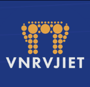

  
  <h1>🚗 VNR Pool - The Ultimate Campus Commute Ecosystem</h1>
  
<strong>Exclusive, Sustainable, and Intelligent Ride-Sharing for VNR VJIET.</strong>

---

## 🌟 Overview
**VNR Pool** is a hyper-localized, closed-ecosystem ride-sharing and carpooling platform built exclusively for the students and staff of VNR VJIET. It tackles the daily challenges of college commutes by providing a secure, economical, and environmentally friendly way to share rides, split cab fares, and connect with peers.

Unlike generic ride-sharing apps (Uber/Ola/Rapido) or unorganized WhatsApp groups, VNR Pool introduces **trust-based networking**, **dynamic fractional fare splitting**, and **gamified eco-sustainability** wrapped in an ultra-premium, cinematic Progressive Web App (PWA).

---

## 🚀 How It Works (Core Steps)

### 1. Exclusive Onboarding
- **Strict Verification:** Users can only sign up using their official `@vnrvjiet.in` email address. 
- **Profile Setup:** Users upload a profile picture, input their Branch, Roll Number, and a valid 10-digit mobile number.
- **Cinematic Auth:** The login screen features a fully interactive, 3D hardware-accelerated rendering of a Ferrari (built with Three.js/React Three Fiber) that responds to mouse and scroll movements.

### 2. Offering a Ride (For Drivers)
- **Ride Creation:** Drivers input their Origin, Destination, Departure Time, and Available Seats.
- **Vehicle Selection:** Choose between a Car or a Bike.
- **Smart Validation:** Vehicle numbers are strictly validated (e.g., `TS 08 XY 1234`) via regex to ensure compliance and security in real-time as the user types.
- **Fare Setting:** Drivers set a base price per seat.

### 3. Finding & Booking a Ride (For Passengers)
- **Smart Feed Sorting:** Live rides aren't just shown chronologically. The feed intelligently sorts rides based on departure proximity, seat availability, and relevance.
- **Filtering:** Passengers can filter by date, specific destination, and toggle **Women-Only** rides.
- **Booking Flow:** Passengers click "Request Seat". The driver receives a notification and must approve or decline the request.

---

## 🔥 Highlighted & Unique Features (The "Why VNR Pool?" Factor)

### 🧠 1. Dynamic Fractional Fare Splitter (Mid-Route Pickups)
This is the crown jewel of VNR Pool. If a passenger joins a ride *mid-route* (e.g., getting picked up halfway to the destination instead of the starting point), they should not pay the full fare.
- **How it works:** Using **Turf.js** spatial analysis and Haversine distance formulas, the algorithm calculates the exact geographical distance of the passenger's sub-route compared to the driver's total route.
- **The Result:** The fare is dynamically fractionated. If a passenger only rides for 40% of the total distance, the system automatically calculates and suggests a 40% fraction of the base price.

### ⚡ 2. The Auto/Cab Splitter Mode
Not everyone has a vehicle. If a student is booking an auto or cab and wants to share the financial burden, they can switch to **Auto/Cab Split Mode**.
- As more students join the cab pool, the total estimated fare is divided dynamically in real-time among the active participants, displaying the exact "Per Head" cost.

### 🤖 3. Integrated AI Chatbot (Powered by Gemini 2.0)
A 24/7 embedded AI assistant lives inside the app.
- **Context-Aware:** It knows exactly how VNR Pool works, how to cancel rides, and how trust scores are calculated.
- **Strict Boundaries:** If a user asks a question completely unrelated to the app (e.g., "What is the capital of France?"), the bot strictly replies with a fallback: *"I'm sorry, I'm only built to help with VNR Pool! I don't know how to answer that. 😅"* to prevent API abuse and hallucinations.

### 💬 4. Real-time In-App Messaging & Live Typing
Once a ride is approved, a private chat channel opens between the driver and passenger.
- **Supabase WebSockets:** Messages are delivered instantly.
- **Live Typing Indicators:** Leveraging broadcast channels, you can see exactly when the other person is typing with a sleek animated `(...)` bubble.

### 📲 5. Native WhatsApp Sharing
- **1-Click Share:** Users can click a share icon to instantly send a beautifully formatted WhatsApp message.
- **Deep Linking:** The shared message includes exact details (Origin, Destination, Time, Price) and a direct URL parameter (e.g., `?ride=123-abc`) so friends can click the link and immediately view that specific ride.

### 🏆 6. Eco-Tiers & Gamification (Canvas Confetti)
We incentivize reducing the carbon footprint.
- **Eco Points:** Users earn points for every shared ride.
- **Tier System:** Bronze, Silver, Gold, and Platinum badges are displayed on public profiles based on accumulated points.
- **Confetti Celebrations:** Hitting a major milestone (like Silver Tier) triggers a physics-based confetti explosion across the screen!

### 🛡️ 7. 3D Rider Profile Cards & Trust Scores
Safety is paramount. Clicking on any user's avatar opens their **Public Profile Dialog**.
- **Interactive 3D Tilt:** The ID card visually tilts based on gyroscope/mouse movement.
- **Trust Scores:** Users rate each other after rides (1-5 stars). The aggregated Trust Score is prominently displayed.
- **Verified Badges:** Clear visual indicators showing the user is a verified VNR VJIET student.
- **Data Privacy:** Mobile numbers are protected and only accessible via deliberate action within active bookings.

### 📱 8. Premium Mobile PWA & Haptics
- **Installable:** VNR Pool is a Progressive Web App (PWA). It can be installed directly to the iOS/Android home screen.
- **Pull-To-Refresh:** Native mobile feel—pulling down the feed triggers a custom spinning loader that invalidates cache and fetches fresh rides.
- **Haptic & Audio Engine:** Using the Web Audio API and `navigator.vibrate`, every major action (booking, error, success) provides subtle, physical tactile feedback and synthesized notification pops without heavy MP3 files.
- **Dark/Light Mode:** 100% compatible. Even complex elements like the 3D Rider Cards automatically adapt their gradients and text contrast to the user's system preference.

---

## 🛠️ Technical Stack
- **Framework:** Next.js 14 (App Router, Server Actions)
- **Styling:** Tailwind CSS + Framer Motion (for buttery smooth micro-animations)
- **Database & Auth:** Supabase (PostgreSQL, Row Level Security, Realtime WebSockets)
- **AI Integration:** Google Gemini 2.0 via Vercel AI SDK
- **3D Graphics:** React Three Fiber, Drei, GSAP (ScrollTrigger)
- **Geospatial Processing:** Turf.js
- **Deployment:** Vercel

---

## 🆚 Why is this better than existing solutions?
1. **Unmatched Trust:** Uber/Ola/Rapido pair you with absolute strangers. VNR Pool pairs you exclusively with college peers.
2. **Zero Commission:** VNR Pool acts as a facilitator. Users split actual costs via UPI without a middleman taking a 30% cut.
3. **Hyper-Niche:** Generic apps don't account for "Auto Splitting" from the campus gate to the metro station. VNR Pool is tailor-made for exact college commuter pain points.
4. **Fractional Fairness:** Traditional carpooling apps charge a flat rate. VNR Pool's geospatial math ensures you only pay for the exact fraction of the distance you traveled.

---

  <i>Built with ❤️ for the VNR VJIET Community.</i>

